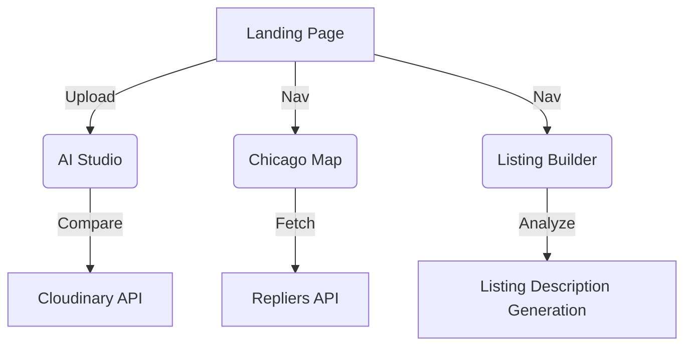

# Project Architecture 🏗️

Estator AI is a Single Page Application (SPA) built with React, focusing on a fluid, state-driven user experience.

## Application Architecture

### View Management
The app uses a centralized `view` state in `App.js` to manage navigation without page refreshes:
- `landing`: The entry point (Hero + Features).
- `studio`: The AI enhancement workspace.
- `chicago-map`: Live property exploration.
- `builder`: The AI listing generation wizard.

### State Flow Diagram

## Key Components

- **Studio Workspace**: Handles complex transformation URL generation for Cloudinary AI (`gen_background_replace`, `gen_remove`, etc.).
- **Listing Wizard**: A 4-step stepper that collects data and images to produce a final marketing package.
- **Chicago Explorer**: A full-screen Leaflet implementation with height-aware resizing and dynamic pin filtering.
